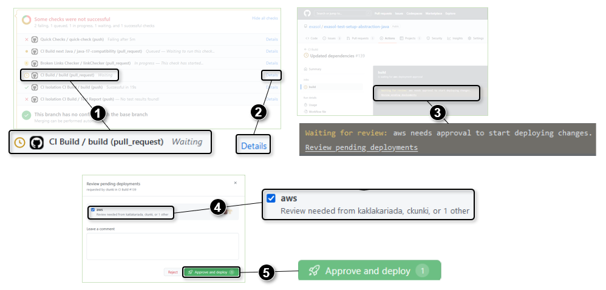

# Developer Guide

## Setting Up AWS Tests

To run tests using the AWS setup, follow these steps:

Create file `cloudSetup/terraform.tfvars` with the following content:

```
owner = "<email>"
deputy = "<email>"
aws_profile = "<profile>"
```

The run the following commands:

```sh
cd cloudSetup/
terraform init
terraform plan
terraform apply
```

Then run integration tests with `mvn verify`.

After tests are completed, delete the cloud setup with

```
cd cloudSetup/
terraform destroy
```

## CI Build

### Approving the AWS Deployment

The CI build job that runs the actual integration tests needs to deploy a test environment on Amazon AWS.

To prevent wasting AWS resources, deploying this environment is set up to request explicit approval by the repository owner or deputy.

1. The build will display a clock icon for github workflow "CI Build"
2. When you click on the details of the workflow
3. then it displays a link you can click to approve allocating the AWS resources.
4. Only selected persons are permitted to give this approval. One of these persons may select the checkbox "aws"
5. and click the button "Approve and deploy".



### In Case CI Build Does Not Terminate

If the github workflow "CI Build" does not terminate and shows messages like the following then the test execution on AWS is probably stuck.

> module.exasol_setup.module.exasol.null_resource.exasol_cluster_wait[0]: Still creating... [14m20s elapsed]

In this case you need to manually login to AWS **test account** and to delete the cloud formation stack.

1. This requires to first switch to role `protected-OrganizationAdminAccountAccessRole`.
2. Next select the cloud formation service
3. and delete all stacks with names like `ETSA-<hash>-exasol-cluster`.

If the delete reports failures for some resources then you need to delete these resources manually.
